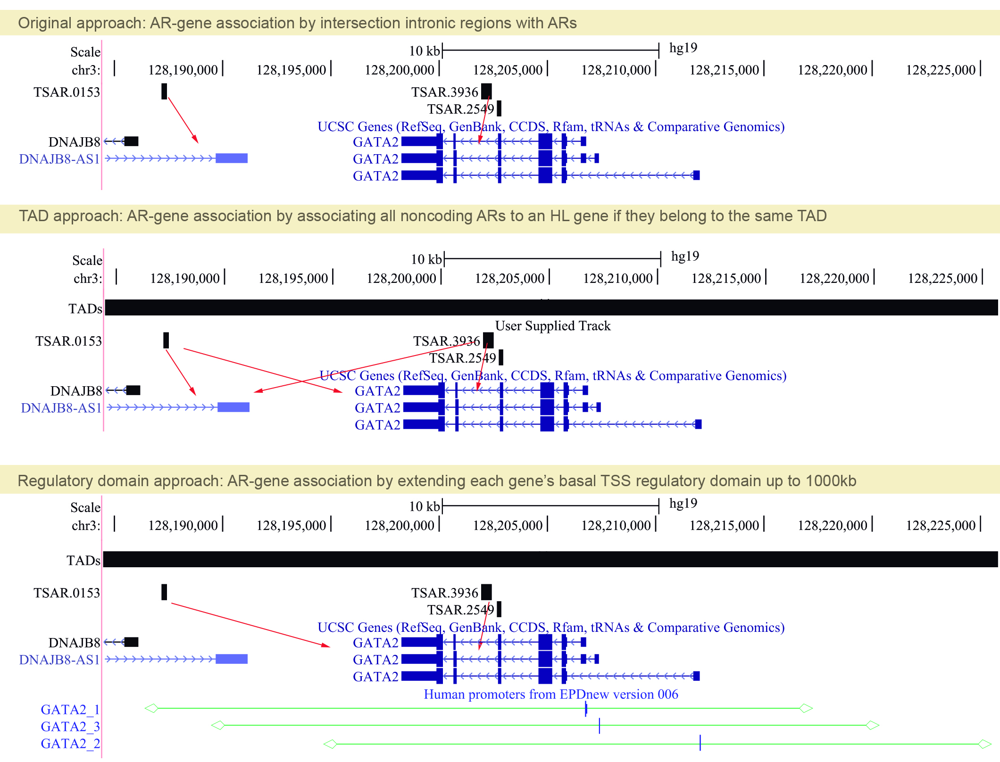

```{r setup, include=FALSE}
knitr::opts_chunk$set(echo = TRUE)
if (!requireNamespace("BiocManager", quietly = TRUE))
    install.packages("BiocManager")

#BiocManager::install("GenomicRanges")
#BiocManager::install("biomaRt")
#install.packages("tidyverse")
library("GenomicRanges")
library("biomaRt")
library("tidyverse")
library("RCurl")
```

## Introduction

In this notebook, I will add two approaches to intersect accelerated elements (ARs) to HL genes. Using a previous approach, we showed that the proportion of noncoding regions acting on HL was higher than the proportion of coding regions. In that initial approach, we used information from each gene's intronic region to subset the number of ARs that overlapped each gene. As per reviewer's suggest, a substantial number of potential regulatory accelerated elements located outside the gene's body could be incorporated.

To accurately determine which potential AR could regulate a HL gene, some extra information about chromatin conformation (such as 4C or Hi-C) should be included. This data is unfortunately inexistent for the inner ear. Therefore, we can think of two approximations that could be more inclusive to try to solve this point:
1) We could use chromatin conformation data from other tissues, since it was shown that since the genome is organized into hierarchical 3D structures, such as topologically associated domains (TADs),  that  are  thought  to  bring distal  regulatory  elements  in  close  proximity  to  the  target promoter.
2) We could define a gene regulatory domain definition, such as that applied in GREAT and other studies (Roscito et al. 2019): Each gene is assigned a basal regulatory domain of a minimum distance upstream and downstream of the TSS (regardless of other nearby genes). The gene regulatory domain is extended in both directions to the nearest gene's basal domain but no more than the maximum extension in one direction.

Using these two approximations, we will calculate if the proportion of noncoding (potentially regulatory) accelerated elements (ARs) is higher than the proportion of changes in coding regions. 


## Read data

Read TADs from fetal human cortical plate [(Won et al. 2016)](https://www.nature.com/articles/nature19847), read HL gene coordinates, read ARs coordinates. 

```{r read_tad}
data <- read.table("TAD_fetalCP_Won2016.bed", col.names=c("chr", "start", "end"))
tad <- with(data, GRanges(chr, IRanges(start, end)))
genome(tad) <- "hg19"
tad
```

Read HL gene coordinates (One BED record was created per whole gene using the transcriptional start site and the transcription end values from the knownCanonical table from the hg19 UCSC Genes track. This canonical transcript reports the longest coding sequence for each entry and includes all the non-coding introns.)
```{r read_gene}
gene_coord_table <- read.table("genecoords.txt", header = TRUE)
gene_coord <- with(gene_coord_table, GRanges(chr, IRanges(start, end), id=gene_name))
genome(gene_coord) <- "hg19"
gene_coord
```

The original TSAR database was downloaded from [Supplementary Table S1 of Holloway et al. 2016](https://academic.oup.com/mbe/article/33/4/1008/2579545#supplementary-data). The reported TSARs were classified as coding if they overlapped an exon. Exons were obtained by exporting a BED file with hg19 UCSC Table Browser [UCSC Genes track: UCSC Genes > knownGene table > output as BED > Exons]. The rest of the TSARs were considered non-coding. 


```{r read_all}
all_TSARs <- read.table("S1_Holloway.txt", header = TRUE)
exons <- read.table("Exons.bed", col.names=c("chr", "start", "end", "id", "value", "strand"))

# Convert to Granges
allTSARs_coord <- with(all_TSARs, GRanges(chr, IRanges(start, end), id=TSAR))
genome(allTSARs_coord) <- "hg19"

exons_coord <- with(exons, GRanges(chr, IRanges(start, end), id=id))
genome(exons_coord) <- "hg19"

```

We subset each group of TSARs into coding and non-coding.

```{r subset_tsars}
# Transform to granges and obtain TSARs that intersect exons
my_overlaps <- findOverlaps(query = exons_coord, subject = allTSARs_coord)

my_query <- queryHits(my_overlaps)
my_subject <- subjectHits(my_overlaps)

# Subset exonic and intronic TSARs

exonic_TSARs <- data.frame(chr = allTSARs_coord[my_subject]@seqnames,
           start = allTSARs_coord[my_subject]@ranges@start,
           end = allTSARs_coord[my_subject]@ranges@start + allTSARs_coord[my_subject]@ranges@width,
           id = allTSARs_coord[my_subject]$id)

exonic_TSARs <- exonic_TSARs %>% unique() # Data Frame
intronic_TSARs <- all_TSARs %>% anti_join(exonic_TSARs,by = c("TSAR" = "id")) #Data Frame

```


Transform non-coding accelerated regions (ARs) in Granges object.
```{r read_ar}
# Transform intronic_TSARs dataframe to GRanges object
intronic_TSARs_coord <- with(intronic_TSARs, GRanges(chr, IRanges(start, end), id=TSAR))
intronic_TSARs_coord
```
## Associate with the original approach
Intersect HL genes with intronic_TSARs, retrieve intronic_TSARs for each gene. 
```{r original approach}
my_overlaps <- findOverlaps(query = gene_coord, subject = intronic_TSARs_coord)

my_query <- queryHits(my_overlaps)
my_subject <- subjectHits(my_overlaps)

# chr,start,end from TAD, id from gene

genes_in_intronic_TSARs <- data.frame(chr = intronic_TSARs_coord[my_subject]@seqnames,
           start = intronic_TSARs_coord[my_subject]@ranges@start,
           end = intronic_TSARs_coord[my_subject]@ranges@start + intronic_TSARs_coord[my_subject]@ranges@width,
           id = gene_coord[my_query]$id)

```


The total number of unique HL genes with non-coding TSARs is: `r length(unique(genes_in_intronic_TSARs$id))`. The percentage of HL genes with non-coding TSARs, when defining non-coding as only intronic elements  is `r length(unique(genes_in_intronic_TSARs$id))*100/length(unique(gene_coord))`%. This is a very conservative estimation, which lacks all of those regulatory elements in 3UTRs or 5UTRs. We therefore can do the same but, this time, consider those intersecting only coding exons as coding TSARs and the rest as non-coding. 

```{r considering noncoding exonic elements}
# Read coding exons and transform into granges
coding_exons <- read.table("CodingExons.bed", col.names=c("chr", "start", "end", "id", "value", "strand"))
codingexons_coord <- with(coding_exons, GRanges(chr, IRanges(start, end), id=id))

my_overlaps <- findOverlaps(query = codingexons_coord, subject = allTSARs_coord)

my_query <- queryHits(my_overlaps)
my_subject <- subjectHits(my_overlaps)

# Subset into coding exons TSARs and intronic/non-coding exonic TSARs

codingexons_TSARs <- data.frame(chr = allTSARs_coord[my_subject]@seqnames,
           start = allTSARs_coord[my_subject]@ranges@start,
           end = allTSARs_coord[my_subject]@ranges@start + allTSARs_coord[my_subject]@ranges@width,
           id = allTSARs_coord[my_subject]$id)

codingexons_TSARs <- codingexons_TSARs %>% unique()
intronic_TSARs_2 <- all_TSARs %>% anti_join(codingexons_TSARs,by = c("TSAR" = "id"))

## Intronic TSARs v2: intersection with HL Genes

intronic_TSARs_2 <- with(intronic_TSARs_2, GRanges(chr, IRanges(start, end), id="TSAR"))
my_overlaps <- findOverlaps(query = gene_coord, subject = intronic_TSARs_2)

my_query <- queryHits(my_overlaps)
my_subject <- subjectHits(my_overlaps)

genes_in_intronic_TSARs_v2 <- data.frame(chr = intronic_TSARs_2[my_subject]@seqnames,
           start = intronic_TSARs_2[my_subject]@ranges@start,
           end = intronic_TSARs_2[my_subject]@ranges@start + intronic_TSARs_2[my_subject]@ranges@width,
           id = gene_coord[my_query]$id)

genes_in_intronic_TSARs_v2_unique <- unique(genes_in_intronic_TSARs_v2$id)

```


 The percentage of unique HL genes with non-coding TSARs, when defining non-coding as intronic + non-coding exons is `r length(unique(genes_in_intronic_TSARs_v2_unique))*100/length(unique(gene_coord))`%. The total number of unique HL genes with non-coding TSARs in this case is: `r length(unique(genes_in_intronic_TSARs_v2$id))`.


## Associate using chromatin conformation data

Intersect HL genes with TADs, retrieve TADs for each gene. 

```{r intersect_tad_genes}
my_overlaps <- findOverlaps(query = gene_coord, subject = tad)

my_query <- queryHits(my_overlaps)
my_subject <- subjectHits(my_overlaps)

# chr,start,end from TAD, id from gene

genes_in_TADs <- data.frame(chr = tad[my_subject]@seqnames,
           start = tad[my_subject]@ranges@start,
           end = tad[my_subject]@ranges@start + tad[my_subject]@ranges@width,
           id = gene_coord[my_query]$id)

genes_in_TADs <-  with(genes_in_TADs, GRanges(chr, IRanges(start, end), id=id))


```

Now that we have the TAD region for each set of HL genes, we will intersect these HL-TADs with the ARs coordinates, to get final set of ARs that are located within HL-TADs. 

```{r intersect_tad_ars}
# Find intersection between ARs and TADs location for each gene
tads_ars_overlaps <- findOverlaps(query = intronic_TSARs_coord, subject = genes_in_TADs)

my_query <- queryHits(tads_ars_overlaps)
my_subject <- subjectHits(tads_ars_overlaps)

# Report chr, start, end from TADs and id from ARs and Gene

ARs_in_HL_TADs <- data.frame(chr = genes_in_TADs[my_subject]@seqnames,
           start = genes_in_TADs[my_subject]@ranges@start,
           end = genes_in_TADs[my_subject]@ranges@start + genes_in_TADs[my_subject]@ranges@width,
           AR_id = intronic_TSARs_coord[my_query]$id,
           Gene_id = genes_in_TADs[my_subject]$id)

```

Finally, we will count the number of AR elements per HL gene.

```{r count_ars}
ARs_in_HL_TADs_count <- ARs_in_HL_TADs %>% group_by(Gene_id) %>% summarize(count = n()) %>% arrange(desc(count))
ARs_in_HL_TADs_count

```


The total number of genes that have elements located in their TAD (defined using Won 2016 data) is:  `r length(unique(ARs_in_HL_TADs$Gene_id))`.The above list includes all intronic ARs elements that are located within a gene's TAD. 

Can we be certain that these AR elements are indeed regulating the genes? *No*. 

This is a very liberal approximation that assumes the following:
- All elements located within a gene's TAD can regulate the gene's promoter.
- An element can overlap several genes at the same time, but all belonging to the same TAD. In this case, the element could potentially regulate all of those genes and even other genes that it does not overlap but belong to the same TAD. 
- The TADs used correspond to human fetal brain data. We are assuming that there is some sort of conservation within tissues and these TADs could be therefore used to infer function in the inner ear tissue. 
The list is probably the upper limit of ARs that could be intersecting the HL genes and a very rough/dirty approximation. This approximation sets the proportion of HL genes with ARs being `r length(unique(ARs_in_HL_TADs$Gene_id))*100/length(unique(gene_coord))`%


```{r TADs with intronic and noncoding-exonic TSARs_v2, echo=FALSE}

# Find intersection between ARs_v2 and TADs location for each gene
tads_ars_overlaps_v2 <- findOverlaps(query = intronic_TSARs_2, subject = genes_in_TADs)

my_query <- queryHits(tads_ars_overlaps_v2)
my_subject <- subjectHits(tads_ars_overlaps_v2)

# Report chr, start, end from TADs and id from ARs and Gene

ARs_in_HL_TADs_v2 <- data.frame(chr = genes_in_TADs[my_subject]@seqnames,
           start = genes_in_TADs[my_subject]@ranges@start,
           end = genes_in_TADs[my_subject]@ranges@start + genes_in_TADs[my_subject]@ranges@width,
           AR_id = intronic_TSARs_2[my_query]$id,
           Gene_id = genes_in_TADs[my_subject]$id)

ARs_in_HL_TADs_v2count <- ARs_in_HL_TADs_v2 %>% group_by(Gene_id) %>% summarize(count = n()) %>% arrange(desc(count))

```
The above calculation was set for intronic TSARs only. We can do the same association but considering intronic + non-coding exonic TSARs. The total number of genes that have elements located in their TAD (defined using Won 2016 data) is:  `r length(unique(ARs_in_HL_TADs_v2count$Gene_id))`.The above list includes all intronic ARs + non-coding exonic elements that are located within a gene's TAD. This approximation sets the proportion of HL genes with ARs (intronic ARs + non-coding exonic) being `r length(unique(ARs_in_HL_TADs_v2$Gene_id))*100/length(unique(gene_coord))`%


## Associate using a gene regulatory domain definition

Definition of gene regulatory domain (GREAT http://great.stanford.edu/public/html/): "Each gene is assigned a basal regulatory domain of a minimum distance upstream and downstream of the TSS (regardless of other nearby genes). The gene regulatory domain is extended in both directions to the nearest gene's basal domain but no more than the maximum extension in one direction."

The basal default settings considers: Proximal (5.0kb upstream, 1.0 kb downstream).

We will replicate these settings in our data and re-associate the ARs to the HL genes. We first need to obtain putative TSS for each of our HL genes: we'll use data from the EPD database (UCSC track: [hub_24769_epdnew6] Human promoters from EPDnew version 006)


```{r read_transform_epd}
epd_in <- read.table("epd_006.txt", header = TRUE)
epd <- epd_in %>% select("chr" = chrom, "start" = chromStart, "end" = chromEnd, strand, name)
epd$name <- str_replace(epd_in$name, "_[:digit:]+" ,"")

# Basal extension:
for (row in 1:nrow(epd)){
    epd$start[row] <- epd$start[row] - 5000   
    epd$end[row] <- epd$end[row] + 1000 
}


# Extension to up to 1000kb:
for (row in 1:nrow(epd)){
    epd$start[row] <- epd$start[row] - 100000   
    epd$end[row] <- epd$end[row] + 100000 
}

```

We now have a data frame with all TSS coordinates extended in a basal regulatory domain (proximal, 5.0kb upstream, 1.0 kb downstream), plus an extension of up to 1000kb. We will filter it based on the HL genes, to get the final HL genes gene regulatory domain definition.


```{r HL_regdomain}
HL_regulatorydomain <- epd %>% filter(name %in% gene_coord_table$gene_name)


HL_regulatorydomain <- with(HL_regulatorydomain, GRanges(chr, IRanges(start, end),strand, name=name))
genome(HL_regulatorydomain) <- "hg19"


```

Now we use this information to intersect regulatory domains with ARs. 


```{r intersect_regdom}
my_overlaps <- findOverlaps(query = HL_regulatorydomain, subject = intronic_TSARs_coord)

my_query <- queryHits(my_overlaps)
my_subject <- subjectHits(my_overlaps)

# Get gene name and ARs intersecting its regulatory domain

genes_regdom_ARs<- data.frame(
           gene = HL_regulatorydomain[my_query]$name,
           AR = intronic_TSARs_coord[my_query]$id)

# Remove duplicates, group by gene, count ARs
Genes_Numb_ARs <- genes_regdom_ARs %>% distinct() %>% group_by(gene) %>% summarize(count = n()) %>% arrange(desc(count))

```

Using this approach the total number of genes that have elements located in their regulatory domain (defined as: basal Proximal (5.0kb upstream, 1.0 kb downstream) + 1000kb each side) is:  `r length(unique(Genes_Numb_ARs$gene))`. This assumes the following:
- The basal domain gene regulatory domain is extended 1000kb each side. This could be greater than the whole gene's size.
- The whole gene regulatory domain could overlap other gene regulatory domains. We cannot be certain if one AR element is exclusive to other element or if there are boundary/isolating elements impeding regulatory domains to overlap. This approximation sets the proportion of HL genes with ARs being `r length(unique(Genes_Numb_ARs$gene))*100/length(unique(gene_coord))`%. The total number of HL genes with non-coding TSARs is `r length(unique(Genes_Numb_ARs$gene))`.

```{r regdom in wide ARs definition, echo=FALSE}
my_overlaps <- findOverlaps(query = HL_regulatorydomain, subject = intronic_TSARs_2)

my_query <- queryHits(my_overlaps)
my_subject <- subjectHits(my_overlaps)

# Get gene name and ARs intersecting its regulatory domain

genes_regdom_ARs_v2<- data.frame(
           gene = HL_regulatorydomain[my_query]$name,
           AR = intronic_TSARs_2[my_query]$id)

# Remove duplicates, group by gene, count ARs
Genes_Numb_ARs_v2 <- genes_regdom_ARs_v2 %>% distinct() %>% group_by(gene) %>% summarize(count = n()) %>% arrange(desc(count))

```
We can do the same association but considering intronic + non-coding exonic TSARs.This approximation sets the proportion of HL genes with ARs being `r length(unique(Genes_Numb_ARs_v2$gene))*100/length(unique(gene_coord))`%


## Comparison to the original approach
### Proportion of non-coding elements overlapping HL genes
The original approach (only intersecting ARs to the intronic non-coding portions of a gene) estimated a total of 14 HL genes with non-coding ARs, which translates to a proportion of ~3%. The gene regulatory domain approach estimates a proportion of ~4%, while the upper limit using the TAD approach is estimated to be ~22%.

### Proportion of coding elements overlapping HL genes
In the original approach, we estimated that a higher proportion of coding elements overlapped HL genes. This was calculated in two ways:
- 53 genes had PAML positive selection. This means ~12%. 
- 63 genes had TSAR coding elements. This translates to: ~15%.
With any of those measures, the proportion of coding elements is higher in comparison to the original estimated approach of non coding elements (~3%) and the regulatory domain approach (~4%). The proportion is not higher when using the TAD approach (~22%), but, as noted above, this is probably a very dirty estimation of the upper limit of elements that could potentially regulate the HL genes.

## Conclusion
Using a very conservative approach, it is estimated that the proportion of noncoding (potentially regulatory) accelerated elements (ARs) is higher than the proportion of changes in coding regions. The same pattern is observed using the regulatory domain approach. This pattern is not observed when using the TAD approach, which probably calculates the upper limit of ARs that could interact with the HL genes and assumes that Hi-C data from another tissue is interchangeable.
```{r table dat, echo=FALSE}
#define data

input <- c('original', 'intronic',length(unique(genes_in_intronic_TSARs$id))*100/length(unique(gene_coord)),
           'original', 'intronic+non_coding exonic',length(unique(genes_in_intronic_TSARs_v2$id))*100/length(unique(gene_coord)),
           'TAD', 'intronic',length(unique(ARs_in_HL_TADs$Gene_id))*100/length(unique(gene_coord)),
           'TAD', 'intronic+non_coding exonic',length(unique(ARs_in_HL_TADs_v2$Gene_id))*100/length(unique(gene_coord)),
           'regulatory domain', 'intronic',length(unique(Genes_Numb_ARs$gene))*100/length(unique(gene_coord)),
           'regulatory domain', 'intronic+non_coding exonic',length(unique(Genes_Numb_ARs_v2$gene))*100/length(unique(gene_coord)),
           'PAML', 'coding',53*100/length(unique(gene_coord)),
           'phyloP', 'coding',63*100/length(unique(gene_coord))
           
         )

df <- matrix(input, ncol = 3, byrow = TRUE) %>%  as_tibble()
names(df) <- c("approach", "type", "percentage")


numeric_df <- as.numeric(df$percentage)
df$percentage <- round(numeric_df, 3)

df

```


## References
https://davetang.org/muse/2013/01/02/iranges-and-genomicranges/

Holloway, A. K., Bruneau, B. G., Sukonnik, T., Rubenstein, J. L., & Pollard, K. S. (2016). Accelerated evolution of enhancer hotspots in the mammal ancestor. Molecular biology and evolution, 33(4), 1008-1018.

Won, H., de La Torre-Ubieta, L., Stein, J. L., Parikshak, N. N., Huang, J., Opland, C. K., ... & Geschwind, D. H. (2016). Chromosome conformation elucidates regulatory relationships in developing human brain. Nature, 538(7626), 523-527.


